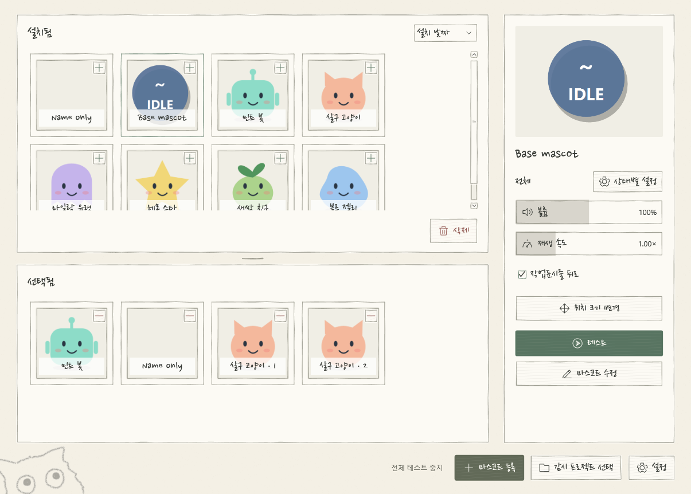
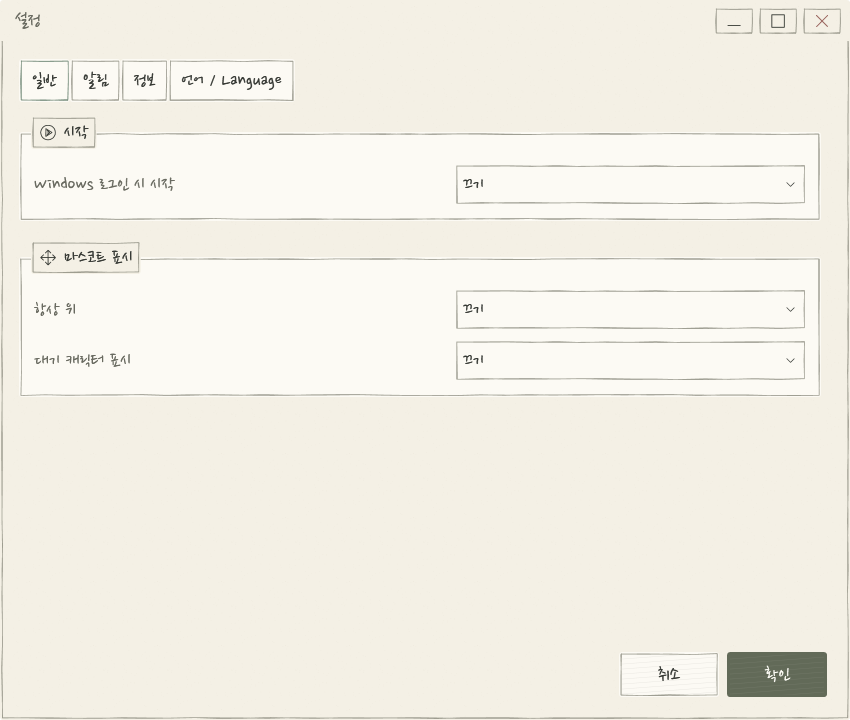

# Agent Mascot for Windows

Codex와 Claude Code에서 **이미 진행 중인 작업**의 상태를 캐릭터가 실시간으로 알려주는 Windows 10/11 x64 트레이 앱입니다. 작업을 끝내면 캐릭터가 팝업과 소리로 알려줍니다.



## 캐릭터가 알려주는 상태

<p align="center">
  
  
  
  
</p>

| 상태 | 캐릭터가 보여주는 것 |
|---|---|
| 작업 중 | 짧은 팝업 |
| 확인/승인 필요 | 계속 표시 · 클릭해서 확인 |
| 응답 완료 | 축하 팝업 + 소리 |
| 실패 | 경고 팝업 + 소리 |
| 중단 | 잠깐 표시 |

## 왜 쓰나요

- **새 작업을 시작할 필요가 없습니다.** 이미 쓰고 있는 Codex/Claude의 진행 상황을 로컬 기록에서 읽어 자동으로 표시합니다.
- **여러 작업을 하나의 캐릭터로** — 작업이 여러 개여도 우선순위에 따라 대표 상태 하나만 보여줍니다.
- **원하는 캐릭터로 교체** — 상태별 GIF·PNG·WebP 이미지와 WAV·MP3 소리를 등록 창에서 지정합니다. 여러 소리를 넣으면 매번 무작위로 재생합니다.
- **여러 마스코트 동시 표시** — 같은 알림을 여러 마스코트가 한 번에 나타나고, 각자 크기·위치·볼륨·속도를 따로 가집니다.
- **클릭하면 원래 도구로** — 팝업을 누르면 Codex/Claude 창을 앞으로 가져옵니다.
- **가벼운 트레이 앱** — X를 눌러도 트레이에서 계속 실행되며, 작업 표시줄에 자리를 차지하지 않습니다.

## 30초 시작하기

1. [최신 릴리스](https://github.com/Obsihill/codex-mascot/releases/latest)에서 `AgentMascot-<version>-Windows-x64.zip`을 내려받습니다(.NET 런타임 포함).
2. 원하는 폴더에 풀고 **AgentMascot.exe**를 실행합니다. DLL과 `assets`, `integration` 폴더를 함께 두세요.
3. 메인 화면 **프로젝트 선택**에서 감시할 폴더·채팅을 체크하고 **확인**을 누릅니다.
4. 평소처럼 Codex나 Claude Code로 작업하세요. 새 이벤트를 3초 이내에 감지합니다.

처음 실행하면 Windows 표시 언어에 따라 한국어 또는 영어로 열립니다. 완전히 종료하려면 Windows 알림 영역의 마스코트 아이콘을 우클릭해 **종료**를 선택하세요.

## 캐릭터 바꾸기

마스코트는 대표 이미지와 6개 상태 이미지·소리를 담은 폴더형 묶음입니다. `library/mascot-<ID>/`에 저장되며, 메인 화면 오른쪽 설정에서 등록·편집합니다.

```text
AgentMascot/
  AgentMascot.exe
  assets/          기본 이미지·소리
  config/          자동 생성되는 개인 설정
  library/         등록한 마스코트 묶음
```

상태별로 **재생/반복·볼륨(최대 200%)·속도·이미지 재생시간·위치·크기**를 조절할 수 있고, **테스트** 버튼으로 팝업과 소리를 바로 확인할 수 있습니다. 기본 제공 마스코트는 **Base mascot**과 **MasCat**(기본 활성)이며, MasCat에는 야옹 소리 7개가 들어 있습니다.

## 설정



- **일반** — Windows 로그인 시 시작, 항상 위, 대기 중 표시
- **알림** — 팝업 클릭 시 Codex 창 열기, 알림 유지
- **연결** — Codex/Claude 데이터 폴더, 감시 상태·프로젝트 선택
- **언어** — 한국어 / English 즉시 전환

## 문서·빌드

- 상세 동작, 상태 판정 기준, Hook 설정, 진단 방법은 [사용 가이드](docs/GUIDE.md)에 있습니다.
- 빌드: `.NET SDK 9.0.306` 이상, .NET 8 WPF 대상

```powershell
dotnet build CodexMascot.sln -c Release
dotnet run --project tests/CodexMascot.Core.Tests -c Release
dotnet run --project tests/CodexMascot.App.Tests -c Release
dotnet publish src/CodexMascot.App -c Release -r win-x64 --self-contained true -o Release
```

GitHub Actions가 push·tag마다 테스트와 self-contained Windows 빌드를 수행합니다.

## 라이선스

MIT License. 외부 라이브러리 조건은 [THIRD-PARTY-NOTICES.txt](THIRD-PARTY-NOTICES.txt)를 참고하세요.
